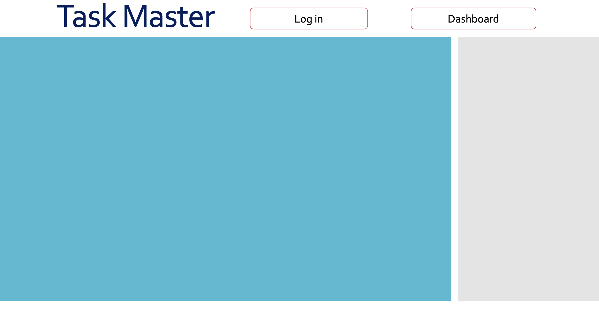
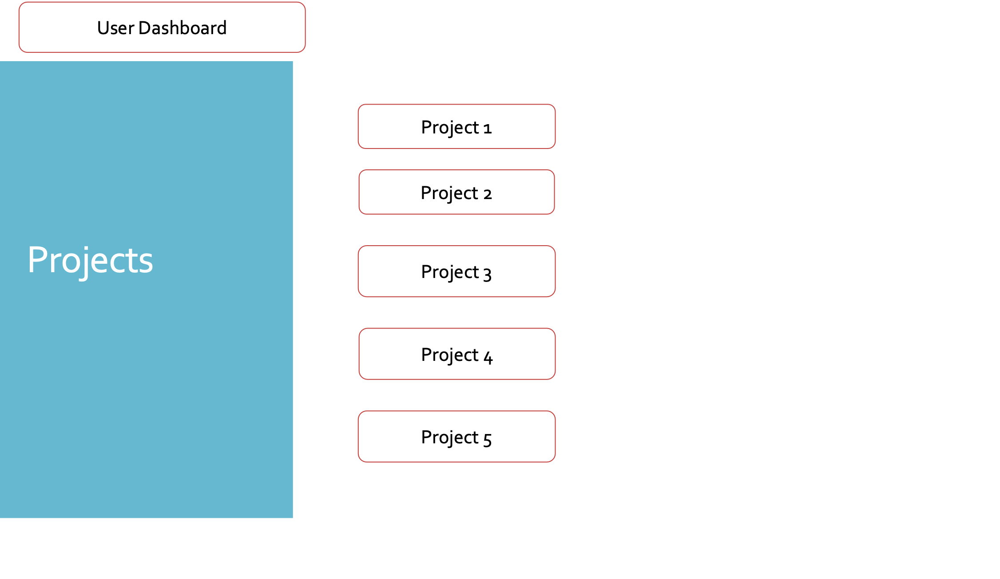
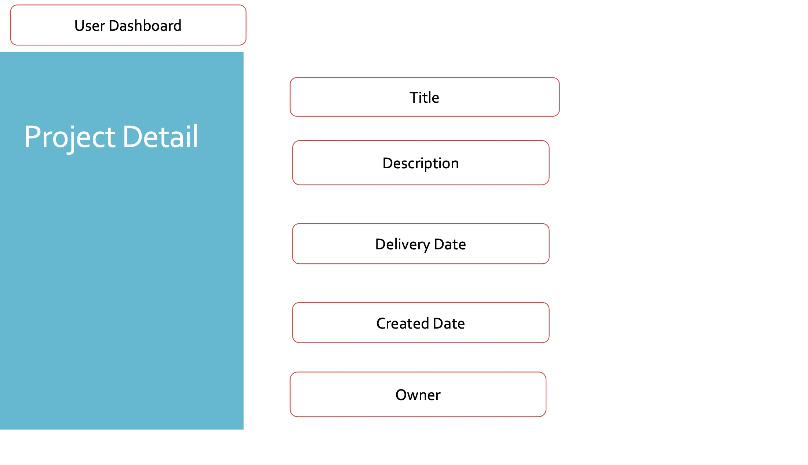
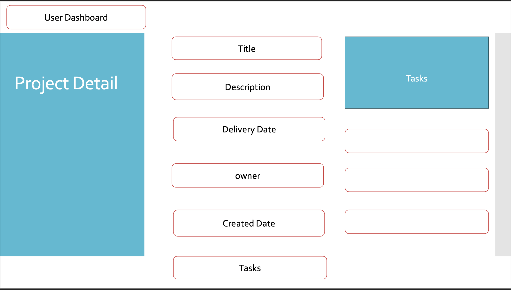
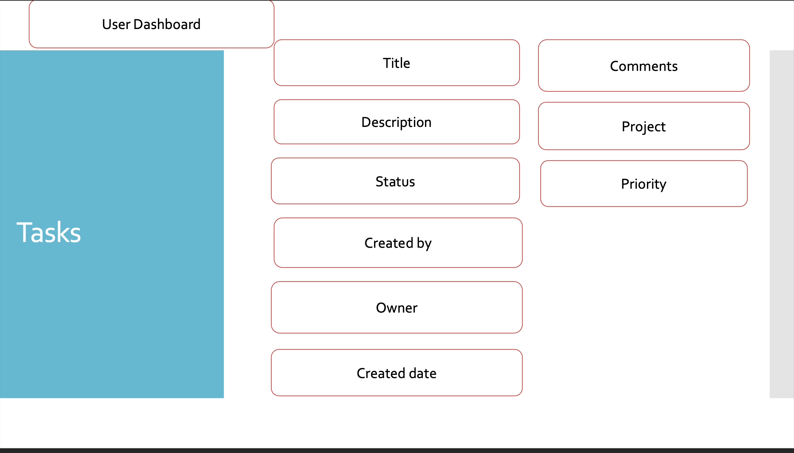
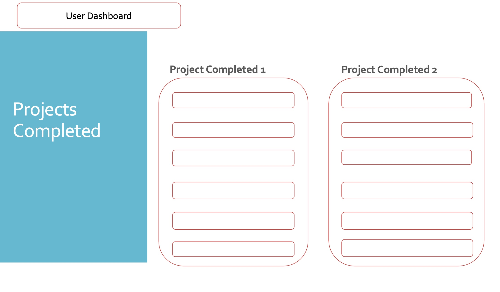
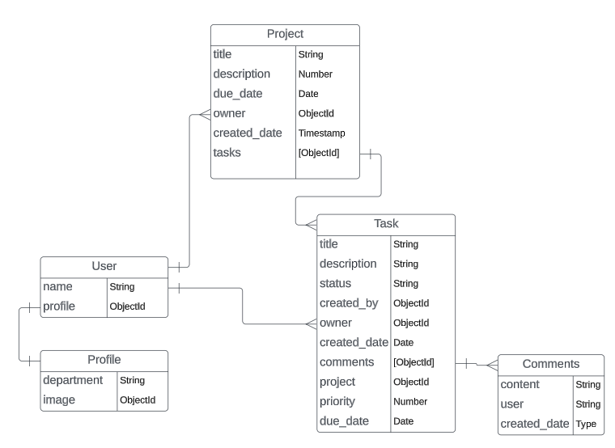

#  Project Description
Task management app where project managers can create, prioritize, and track tasks. Including features like due dates, task project, task comments and task assignments.

#  Introduce the team
Lucas Richards: Software Architect, Backend Engineer

Kate Attardo: Scrum Master, Backend Engineer

Wahid Siddiqi: GithubMaster, Backend Engineer

#  Technologies Used
* Python
* Django
* Postgres
* HTML
* AWS

#  User Stories
* As a User I want to assign tasks to employees
* As a User I want to assign tasks to departments
* As a User I want to tasks to a project
* As a User I want to create a profile with a pictures
* As a User I want to see all tasks assigned to different employees
* As a Manager I want to assign tasks to employees
* As a User I want to see the project status
* As a Employee I want to complete tasks

#  Wireframes

#  ERD

#  MVP

#  Icebox features
